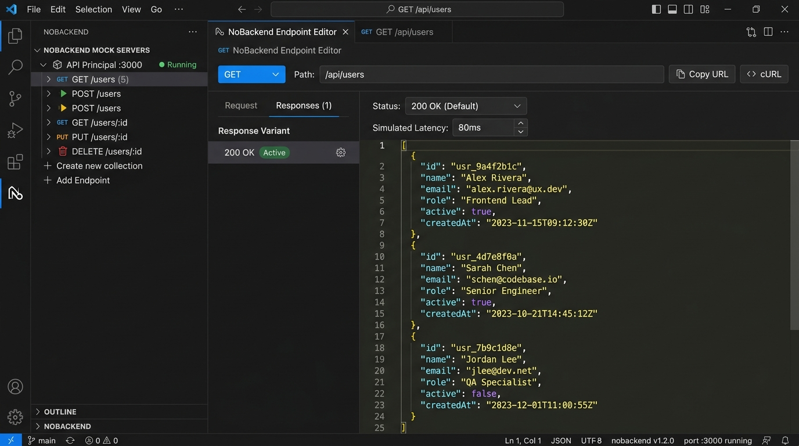

# NoBackend - Mock Server for VS Code

[](https://github.com/vitorbastosbn/NoBackend)
[](https://github.com/vitorbastosbn/NoBackend/blob/main/LICENSE)
[](https://github.com/vitorbastosbn/NoBackend)
[](https://github.com/vitorbastosbn)

Create and manage full local mock servers with HTTP routes (GET, POST, PUT, PATCH, DELETE), custom status codes, simulated latency, and CORS directly inside VS Code.

---



---

## Overview

**NoBackend** is an extension designed to accelerate frontend and integration development. It eliminates the dependency on external APIs in development or separate tools: HTTP mock servers run directly from the VS Code workspace, with support for multiple ports, real-time variant responses, and strict request matching rules.

---

## Key Features

### Visual Server and Route Management
- Configure multiple local servers on distinct ports (e.g. 3000, 3001, 8080).
- Dedicated editor for endpoints with configurable global prefixes (e.g. `/api`, `/v1`).
- Quick toggles to start, stop, and restart server instances individually or in bulk.

### HTTP Methods and CORS Pre-flight
- Native support for `GET`, `POST`, `PUT`, `PATCH`, `DELETE`, and `OPTIONS` verbs.
- Automatic handling of CORS pre-flight requests and `Access-Control-Allow-Origin: *` headers togglable per server.

### Response Variants per Endpoint
- Define multiple scenarios for the same route (e.g. `200 Success`, `400 Bad Request`, `404 Not Found`, `500 Internal Error`).
- Instant toggling of the active response without needing to restart the mock server.
- Support for standardized status codes and custom codes (100 to 599).

### Simulated Latency (Delay)
- Configure delay in milliseconds per response variant to validate loading states, spinners, and client timeout policies.

### Dynamic Parameters and Request Validation
- Route parameter extraction (e.g. `/users/:id`) with dynamic interpolation in the response body (`:id` or `{{id}}`).
- Interpolation of query parameters in the returned payload (`{{query.param}}`).
- Optional validation of incoming headers, query parameters, and JSON payloads.

### Configuration Persistence
- Stored in `~/.nobackend/servers.json` in the user's home directory.
- Global persistence across projects and workspaces.

### Native Internationalization (i18n)
- Full support for three languages:
  - **English**
  - **Portuguese (Brazil)**
  - **Spanish**
- Automatic detection based on the active VS Code language (`vscode.env.language`).

---

## Usage Guide

### 1. Accessing the Extension
- Click on the **NoBackend** icon in the VS Code Activity Bar.
- The server tree will display the configured servers and their respective routes.

### 2. Creating a New Server
- In the sidebar view title area, click the `+` button (Add New Server).
- Enter a descriptive name, desired port (e.g. 3000), optional prefix (e.g. `/api`), and confirm.

### 3. Adding and Editing Routes
- Click the `+` button on a server to create a route.
- Click on the route in the sidebar tree to open the configuration screen.
- Define the HTTP method, endpoint path, and configure response variants with status code, delay, and JSON payload.

### 4. Calling the Endpoint
Execute HTTP calls directly from your terminal, REST client (Insomnia, Postman), or frontend application:

```bash
# List users (GET)
curl -i http://localhost:3000/api/users

# Create user (POST)
curl -i -X POST http://localhost:3000/api/users \
  -H "Content-Type: application/json" \
  -d '{"name": "New User", "email": "user@example.com"}'

# Get specific user by ID
curl -i http://localhost:3000/api/users/42
```

---

## Configuration File Structure

Configurations are maintained in `.nobackend/servers.json`:

```json
{
  "version": "1.0.0",
  "servers": [
    {
      "id": "srv_users_3000",
      "name": "Main API",
      "port": 3000,
      "prefix": "/api",
      "cors": true,
      "enabled": true,
      "routes": [
        {
          "id": "route_get_users",
          "path": "/users/:id",
          "method": "GET",
          "activeResponseId": "resp_200",
          "responses": [
            {
              "id": "resp_200",
              "name": "200 Success",
              "statusCode": 200,
              "delay": 50,
              "headers": {
                "Content-Type": "application/json"
              },
              "body": "{\n  \"id\": \":id\",\n  \"name\": \"Maria Silva\"\n}"
            }
          ]
        }
      ]
    }
  ]
}
```

---

## Project and Developer Info

- **Repository:** [https://github.com/vitorbastosbn/NoBackend](https://github.com/vitorbastosbn/NoBackend)
- **Issues:** [https://github.com/vitorbastosbn/NoBackend/issues](https://github.com/vitorbastosbn/NoBackend/issues)
- **Developer:** [Vitor Bastos](https://github.com/vitorbastosbn) (`vitorbastosbn@gmail.com`)

---

## License

Distributed under the MIT License. See the [LICENSE](LICENSE) file for more information.

Copyright (c) 2026 Vitor Bastos.
