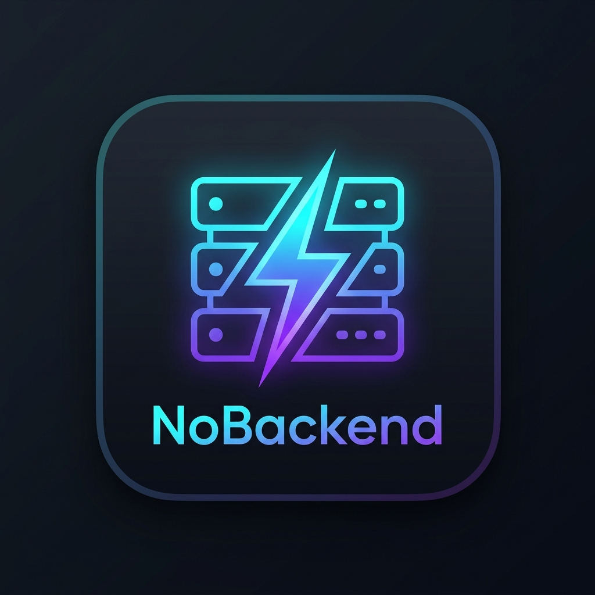

# NoBackend - Mock Server para VS Code ⚡

> Crie e gerencie servidores mock locais completos (GET, POST, PUT, PATCH, DELETE) com múltiplos status codes, latência simulada e CORS direto no seu editor, como um **Mockoon** integrado ao VS Code.



---

## 🎯 Por que o NoBackend?

Quando desenvolvemos aplicações frontend (React, Vue, Angular, Mobile, etc.) ou integramos serviços, muitas vezes precisamos de uma API REST funcionando antes mesmo do backend estar pronto. O **NoBackend** elimina a necessidade de instalar ferramentas externas ou rodar scripts avulsos: ele roda diretamente dentro do seu VS Code com gerenciamento de múltiplas portas, rotas parametrizadas e respostas variantes configuráveis.

---

## ✨ Principais Funcionalidades

- **🎛️ Painel Visual Completo (Webview Dashboard):**
  - Crie, edite e organize servidores e rotas com facilidade.
  - Alternador rápido para iniciar ou parar servidores com 1 clique.
  - Indicadores visuais em tempo real (portas ativas, contagem de rotas).

- **🌐 Suporte Completo a Verbos HTTP:**
  - `GET`, `POST`, `PUT`, `PATCH`, `DELETE` e `OPTIONS`.

- **🔄 Múltiplas Respostas por Rota (Variantes):**
  - Configure diferentes cenários para a mesma rota (ex: `200 Sucesso`, `400 Validação Incorreta`, `404 Não Encontrado`, `500 Falha no Banco`).
  - Alterne qual resposta está ativa com apenas 1 clique, sem precisar reiniciar nada.

- **⏱️ Latência Simulada (Delay):**
  - Configure delays personalizados em milissegundos para testar loading states, spinners e timeouts na sua aplicação cliente.

- **🔗 Rotas Parametrizadas:**
  - Suporte a parâmetros dinâmicos de rota (ex: `/api/users/:id`).
  - O valor do parâmetro é automaticamente substituído no corpo da resposta (`:id` ou `{{id}}`).

- **🛡️ CORS Automático:**
  - Headers `Access-Control-Allow-Origin: *` e tratamento de pre-flight `OPTIONS` habilitados por padrão para qualquer cliente web ou aplicação frontend.

- **📝 Persistência no Workspace:**
  - Mocks salvos em `.nobackend/servers.json` dentro do seu repositório.
  - Versionável no Git e fácil de compartilhar com todo o time de desenvolvimento.

- **🌲 Integração com a Barra Lateral (Sidebar TreeView):**
  - Visualização hierárquica dos servidores e suas rotas.
  - Ações rápidas de Play/Stop e atalho direto para a edição.

- **📋 Logs em Tempo Real:**
  - Canal de saída nativo do VS Code (`NoBackend Server`) registrando método, caminho, status retornado e tempo de execução de cada requisição.

---

## 🚀 Como Usar

1. **Abrir o Dashboard:**
   - Clique no ícone de raio/servidor do **NoBackend** na barra de atividades lateral do VS Code.
   - Ou pressione `Ctrl+Shift+P` (ou `Cmd+Shift+P`) e digite `NoBackend: Abrir Dashboard`.

2. **Iniciar um Servidor:**
   - No Dashboard ou na barra lateral, clique no botão **Play** (ou "Iniciar Todos").
   - O servidor iniciará na porta configurada (ex: `http://localhost:3000`).

3. **Fazer Chamadas Externas (Insomnia, Postman, curl ou Frontend):**
   - Chame a rota diretamente pelo seu cliente HTTP favorito:
   ```bash
   # Listar usuários
   curl -i http://localhost:3000/api/users

   # Criar usuário
   curl -i -X POST http://localhost:3000/api/users \
     -H "Content-Type: application/json" \
     -d '{"name": "Novo Usuário", "email": "novo@example.com"}'

   # Buscar por ID
   curl -i http://localhost:3000/api/users/42
   ```

4. **Alternar Status de Resposta:**
   - No painel da rota, selecione a aba da variante desejada (ex: `500 Erro Interno`) e clique em **"Definir como Ativa"**.
   - A próxima requisição feita pelo Insomnia ou frontend receberá imediatamente o status `500` com o respectivo corpo de erro!

---

## 📦 Estrutura do Arquivo de Configuração

O arquivo `.nobackend/servers.json` pode ser commitado no seu repositório Git:

```json
{
  "version": "1.0.0",
  "servers": [
    {
      "id": "srv_3000",
      "name": "API Principal",
      "port": 3000,
      "prefix": "/api",
      "cors": true,
      "enabled": true,
      "routes": [
        {
          "id": "r_1",
          "path": "/users/:id",
          "method": "GET",
          "activeResponseId": "resp_200",
          "responses": [
            {
              "id": "resp_200",
              "name": "200 Sucesso",
              "statusCode": 200,
              "delay": 100,
              "headers": { "Content-Type": "application/json" },
              "body": "{\n  \"id\": \":id\",\n  \"name\": \"Maria Silva\"\n}"
            }
          ]
        }
      ]
    }
  ]
}
```

---

## 📄 Licença

MIT © NoBackend
